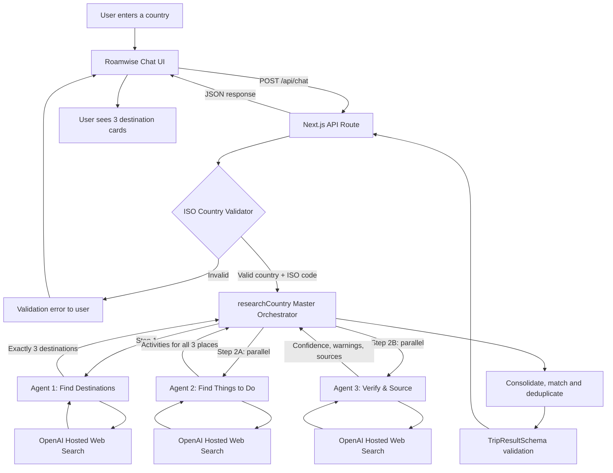
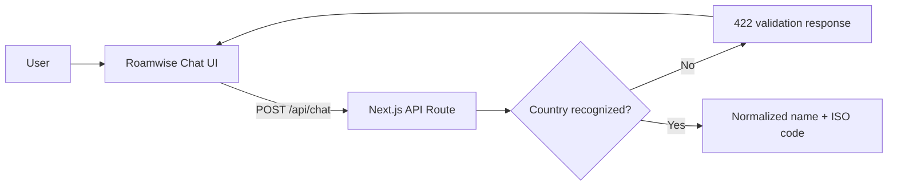
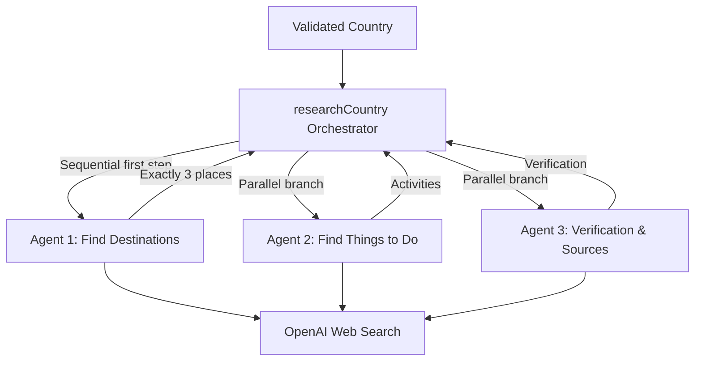
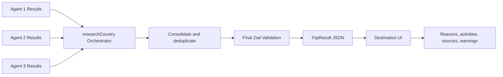

# Roamwise Travel Research Agent

## Solution Kit (Code-Based Track)

**Project:** VacationPlace Finder / Roamwise  
**Interface:** Next.js chat application  
**AI platform:** OpenAI Responses API  
**Demo URL:** `http://localhost:3000` (local development)  
**Demo video:** _Add recording link here_

---

## 1. Use Case Overview

Roamwise is a multi-agent travel research application that accepts a country name through a conversational interface and returns a curated shortlist of exactly three tourist destinations. Each recommendation includes an explanation of why it stands out, a set of activities, traveler-fit tags, a confidence score, verification notes, and source links.

The workflow begins by extracting and validating a country deterministically against ISO 3166 data. Invalid or ambiguous input is rejected before any paid AI request is made. For a valid country, a Destination Agent researches and selects three locations. A Things-to-Do Agent and a Verification & Sources Agent then work concurrently on the selected destinations. Finally, the server merges and validates the research before rendering it in the chat interface.

The application is designed for travelers who want a fast, researched starting point without reading dozens of destination lists. Recommendations are presented as curated suggestions rather than objectively definitive rankings.

## 2. Solution Description

The solution combines deterministic input validation with live AI-assisted web research. A Next.js backend acts as the Master Agent and controls the workflow. Three specialist OpenAI calls perform destination discovery, activity research, and independent verification. OpenAI hosted web search supplies current information, while Zod schemas enforce predictable agent outputs.

The frontend is a responsive React chat experience. It displays the user's request, research progress, three ranked destination sections, expandable activity lists, confidence indicators, warnings, authoritative links, and a research timestamp. The OpenAI API key remains on the server and is never sent to the browser.

Unlike a raw screen-scraping solution, hosted web search reduces custom scraping infrastructure and returns source-aware results. The design can later support additional travel APIs through the same research layer.

## 3. Architecture

The `researchCountry()` function is the Master Orchestrator. It controls the order of all three LLM agents, passes destination names between them, runs independent work concurrently, consolidates their results, and returns one validated response to the chat interface. Country validation is a deterministic guardrail, not an agent.

### End-to-End Architecture — User Chat to User Response



The workflow is also separated below into three focused views: input and validation, multi-agent research, and response composition.

### Part 1 of 3 — Chat Input and Country Validation



### Part 2 of 3 — Multi-Agent Research



### Part 3 of 3 — Consolidation and Presentation



## 4. Architecture Breakdown

**Total LLM calls per successful run: 3**  
Destination discovery ×1 · Activity research ×1 · Verification ×1

The first call is sequential because the other agents need the selected destination names. The second and third calls run concurrently with `Promise.all`, reducing total response time.

### Component Deep Dives

### 4.1 Chat Interface

The React client in `app/page.tsx` provides a single-country chat experience. It maintains the input, active query, loading state, error state, and structured trip result. Suggested country buttons offer quick-start examples.

The submit handler reads the visible form value directly through `FormData`. This handles typed, restored, and browser-autofilled values reliably. While research is running, the interface shows an agent progress card. A successful response is rendered as three ranked destination sections rather than an unstructured chat paragraph.

### 4.2 Country Recognition and Validation

`lib/countries.ts` validates user input before an OpenAI request is made. It loads official English country names from `i18n-iso-countries`, normalizes capitalization and accents, and detects country names inside conversational requests.

An alias map supports common variations such as:

- `USA`, `America`, and `United States` → `US`
- `UK`, `Britain`, and `England` → `GB`
- `South Korea` → `KR`
- `Vietnam` → `VN`

Cities and unrelated phrases return `null`, allowing the API to show a helpful validation message without spending model tokens.

### 4.3 API Route / Master Agent Entry Point

`app/api/chat/route.ts` is the protected server entry point. It:

1. Parses a JSON request containing a message.
2. Limits the message to 500 characters.
3. Validates and normalizes the country.
4. Calls the multi-agent research orchestrator.
5. Returns the final structured result or a user-safe error.

The OpenAI error itself is logged on the server. The browser receives a concise message that does not expose credentials or backend implementation details.

### 4.4 Destination Agent

The Destination Agent is the discovery call. It uses OpenAI hosted web search and must return exactly three distinct destinations. Selection criteria include cultural or natural significance, visitor appeal, experience variety, and accessibility.

Each destination contains:

- Name and region
- Short summary
- Reason for recommendation
- One to four traveler-fit tags
- One to four source records

### 4.5 Parallel Research Branch

After the destination list is available, the Master Agent starts the Things-to-Do Agent and Verification Agent simultaneously. Neither agent may change the destination list.

This dependency-aware pattern offers a better latency profile than running all three calls sequentially, while avoiding the logical error of asking downstream agents to research destinations that have not yet been selected.

### 4.6 Things-to-Do Agent

The activity agent returns three to five activities for each selected destination. Every activity includes:

- Activity name
- Concise description
- Realistic duration
- Booking or planning tip

Activities are matched back to their destination by a case-insensitive name comparison during composition.

### 4.7 Verification & Sources Agent

The verifier independently checks that each destination is a strong and currently visitable recommendation. It provides:

- Confidence score from 0 to 1
- Verification note
- Fresh supporting sources
- Run-level warnings for closures, access restrictions, or unsupported claims

Research prompts prefer official tourism boards, UNESCO, national parks, museums, and official attraction websites.

### 4.8 Structured Output and Consolidation

`lib/types.ts` defines every agent contract with Zod. The OpenAI SDK converts these contracts into Structured Output schemas. The Master Agent merges the three outputs, deduplicates sources by URL, caps each destination at four sources, adds an ISO timestamp, and validates the complete `TripResult` before responding.

Source URLs use an HTTP(S) regular-expression constraint rather than Zod's `.url()` format because the OpenAI Structured Output schema validator does not accept JSON Schema's `format: "uri"` in this workflow.

### 4.9 Presentation and Source Links

The UI renders each destination with a rank, region, confidence badge, explanation, tags, expandable activities, and verified links. Long source labels are shortened to a readable title or hostname. The complete URL remains available through the link tooltip and opens in a new browser tab.

### Key Design Decisions

| Decision | Rationale |
|---|---|
| Deterministic country validation | More predictable and less expensive than asking an LLM to validate every input |
| Three specialist calls | Keeps responsibilities and output contracts focused |
| Parallel downstream agents | Reduces latency after destination discovery |
| Hosted web search | Avoids maintaining brittle screen-scraping logic |
| Structured Outputs with Zod | Prevents malformed agent responses from reaching the UI |
| Server-only OpenAI client | Protects the API key |
| Source verification agent | Improves freshness and identifies travel warnings |
| Curated “top three” language | Avoids presenting a subjective ranking as objective fact |

## 5. Prompt Library

All three agents share the following research rule:

> Use current web research. Prefer official tourism boards, UNESCO, national parks, museums, and official attraction sites. Never invent a URL. Keep descriptions useful and concise.

Output structure is enforced through Zod/Structured Outputs rather than relying on instructions such as “return valid JSON.”

### 5.1 Find Destinations Agent

```text
You are the Find Destinations Agent.

Select exactly three distinct tourist destinations in {{ country }}.
Balance cultural or natural significance, visitor appeal,
experience variety, and accessibility.
Explain why each belongs in the top three.
```

### 5.2 Find Things-to-Do Agent

```text
You are the Things to Do Agent.

For each destination in {{ country }}, provide 3–5 varied,
specific activities: {{ destination_names }}.
Include a realistic duration and a short booking tip.
Do not change the destination list.
```

### 5.3 Verification & Sources Agent

```text
You are the Verification and Sources Agent.

Verify these recommended destinations in {{ country }}:
{{ destination_names }}.
Confirm that each is a strong, currently visitable recommendation,
give a confidence from 0 to 1, and return fresh authoritative sources.
Note closures, access issues, or unsupported claims in warnings.
```

### 5.4 Master Composition Logic

The final composition is deterministic application code rather than another LLM call. It joins activities and verification results to destinations by name, deduplicates sources, applies safe fallbacks, and validates the complete result.

### Implementation Guide

This guide covers setup, verification, and common failure points.

#### Prerequisites

- Node.js LTS and npm
- An OpenAI API key with billing/API access
- Network access to the OpenAI API
- A modern browser

#### Phase 1 — Configure the Application

Install dependencies:

```powershell
npm install
```

Create `.env.local` in the project root:

```env
OPENAI_API_KEY=your_actual_api_key
OPENAI_MODEL=gpt-5.4-mini
```

Never commit `.env.local`. It is excluded by `.gitignore`.

#### Phase 2 — Start the Development Server

```powershell
npm run dev
```

Open `http://localhost:3000`. Keep the terminal running while using the application. If port 3000 is occupied, Next.js may select port 3001 and display that address in the terminal.

**Test checkpoint:** The Roamwise landing page should load, and entering `Japan` should enable the arrow button.

#### Phase 3 — Validate Country Handling

Try the following inputs:

| Input | Expected behavior |
|---|---|
| `Japan` | Accepted as JP |
| `Show me places in South Africa` | Accepted as ZA |
| `I want to visit the UK` | Accepted as GB |
| `Paris` | Rejected because it is a city, not a country |
| `somewhere sunny` | Rejected with a country guidance message |

Run the automated tests:

```powershell
npm test
```

#### Phase 4 — Verify the Multi-Agent Result

Submit a valid country. A successful response should contain:

1. Exactly three destinations.
2. A reason and confidence score for each destination.
3. Three to five activities for each destination.
4. Clickable source links.
5. A research date.
6. Warnings when the verifier identifies an issue.

#### Phase 5 — Production Build Check

```powershell
npm run build
```

The build should complete with `/` as a static frontend route and `/api/chat` as a dynamic server route.

### Common Errors and Fixes

| Symptom | Cause | Fix |
|---|---|---|
| `npm is not recognized` | Current terminal does not have Node on `PATH` | Close all VS Code windows, reopen VS Code, and start a new terminal |
| `localhost:3000 failed to load` | Development server is not running | Run `npm run dev` and keep the terminal open |
| Application says API key is not configured | Key is missing or was added to `.env.example` | Put it in `.env.local`, then restart the server |
| `Research is temporarily unavailable` | OpenAI request or response validation failed | Inspect the server terminal for the underlying error |
| Button remains disabled with text visible | Browser-restored input was not reflected in React state | Current implementation reads the visible value through `FormData`; restart and hard-refresh |
| Server starts on port 3001 | Port 3000 is already occupied | Use the URL printed by Next.js or stop the older server with `Ctrl+C` |
| OpenAI rejects `format: uri` | URL schema used unsupported JSON Schema format | Use the implemented HTTP(S) pattern constraint |
| Final result rejects source count | Merged sources exceeded schema maximum | Deduplicate and cap sources at four per destination |

### Testing Checklist

- [x] Exact country names are recognized.
- [x] Countries are extracted from conversational requests.
- [x] Common aliases such as USA and UK are supported.
- [x] Cities and unrelated phrases are rejected.
- [x] OpenAI credentials remain on the server.
- [x] Destination Agent returns exactly three places.
- [x] Activity and verification research run concurrently.
- [x] Every destination contains activities.
- [x] Final output is schema-validated.
- [x] Source links are readable and clickable.
- [x] Production build completes successfully.
- [ ] Add automated API tests with mocked OpenAI responses.
- [ ] Add browser-level tests for submission, errors, and mobile layout.

## 6. Architectures We Considered

Three alternative architectures were evaluated before selecting the dependency-aware three-agent workflow.

### 6.1 Single Monolithic LLM Call

One model call could select destinations, find activities, verify sources, and write the response.

**Advantages:** Lowest orchestration complexity and potentially lower latency.  
**Disadvantages:** Larger prompt, weaker separation of responsibilities, more difficult output recovery, and no independent verification. A single malformed result would fail the entire workflow.

### 6.2 Fully Sequential Three-Agent Workflow

Destination, activity, and verification agents could run one after another.

**Advantages:** Simple execution order and easier step-by-step logging.  
**Disadvantages:** Verification does not depend on activity output, so making it wait adds unnecessary latency. The selected design runs independent downstream work concurrently.

### 6.3 Raw Website Scraping Pipeline

The backend could directly scrape tourism websites and pass extracted text to the agents.

**Advantages:** Full control over retrieval and page parsing.  
**Disadvantages:** Site-specific HTML changes, robots and terms compliance, anti-bot systems, rate limiting, content sanitization, and significant maintenance. Hosted web search is more appropriate for the first version.

### 6.4 External Travel API as the Primary Source

The application could use providers such as Google Places, Tripadvisor, or Amadeus.

**Advantages:** Structured location data, coordinates, ratings, opening hours, and images.  
**Disadvantages:** Additional credentials, commercial terms, quotas, and provider lock-in. This remains a strong future enhancement for factual place metadata.

## 7. Future Work

The current application reliably validates a country and returns three researched, source-backed destinations. The following improvements would strengthen production readiness.

### 7.1 Reliability and Error Handling

- Add individual timeouts and retry policies for each agent.
- Return partial results if the verifier fails after destination and activity research succeed.
- Introduce structured internal error codes without exposing sensitive provider messages.
- Validate that every returned activity is matched to a known destination.
- Add source-domain allowlists and URL availability checks.

### 7.2 Performance and Cost

- Cache results by normalized ISO country code and model version.
- Add a short cache duration for volatile travel warnings and a longer duration for destination summaries.
- Track tokens, web-search calls, latency, and failure rates per agent.
- Evaluate smaller models for activity generation while retaining a stronger verifier.
- Stream genuine backend progress events rather than displaying a static progress sequence.

### 7.3 Feature Expansion

- Ask for travel month, trip length, budget, mobility requirements, and interests.
- Support follow-up questions without repeating the full research workflow.
- Add maps, coordinates, travel time between destinations, weather, and destination imagery.
- Offer family, adventure, food, history, accessibility, and nightlife modes.
- Generate a day-by-day itinerary from the chosen destination.
- Allow users to save, compare, and export shortlists.

### 7.4 Integrations

- Add a structured places provider for ratings, opening hours, and coordinates.
- Add weather and government travel-advisory APIs.
- Export results to PDF, email, Notion, or a calendar.
- Add analytics and OpenAI tracing for production observability.

### 7.5 Security and Governance

- Add request rate limiting and abuse protection.
- Apply spend limits and per-session request quotas.
- Redact secrets and personal information from logs.
- Add a privacy notice and data-retention policy.
- Run dependency and application security checks in CI.

---

## Project File Map

| File | Purpose |
|---|---|
| `app/page.tsx` | Chat interface and result presentation |
| `app/globals.css` | Responsive visual design |
| `app/api/chat/route.ts` | Server API and country-validation entry point |
| `lib/countries.ts` | ISO country recognition and aliases |
| `lib/agents.ts` | Three-agent OpenAI orchestration |
| `lib/types.ts` | Zod contracts and shared result types |
| `lib/openai.ts` | Server-only OpenAI client configuration |
| `lib/countries.test.ts` | Country-validation unit tests |
| `.env.local` | Local secrets; excluded from Git |
| `README.md` | Setup and operating instructions |
